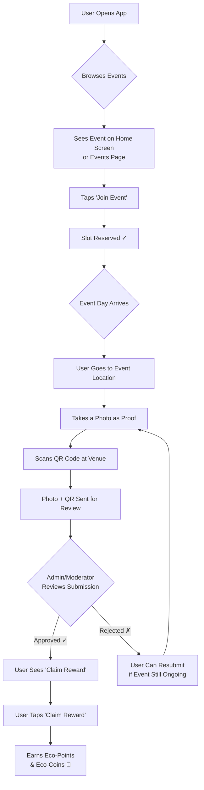
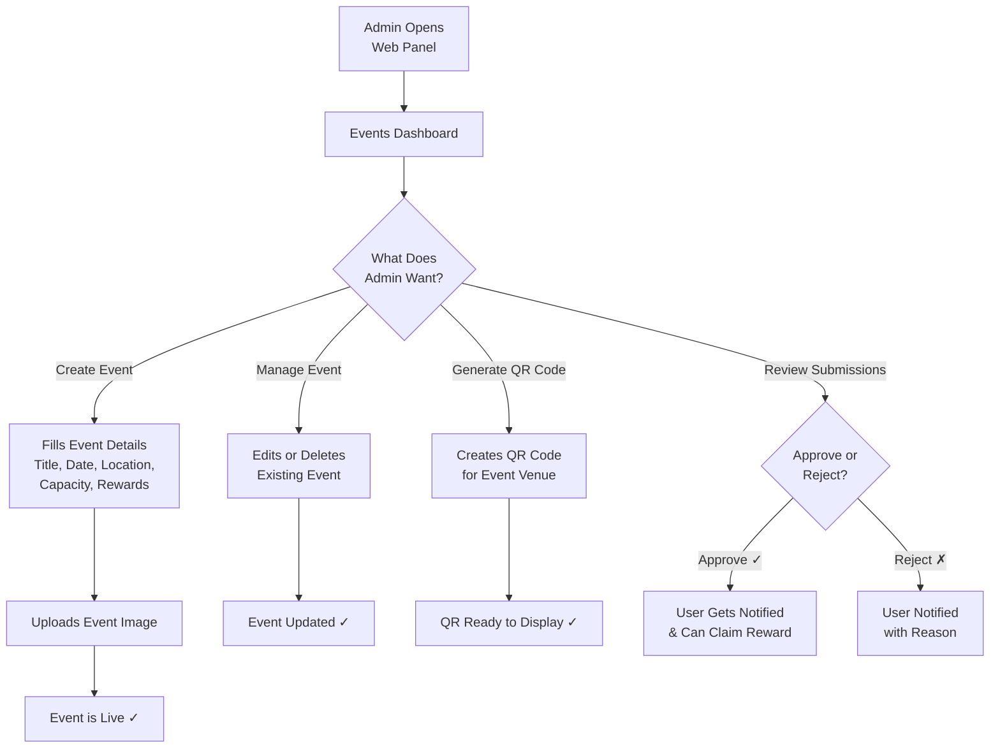
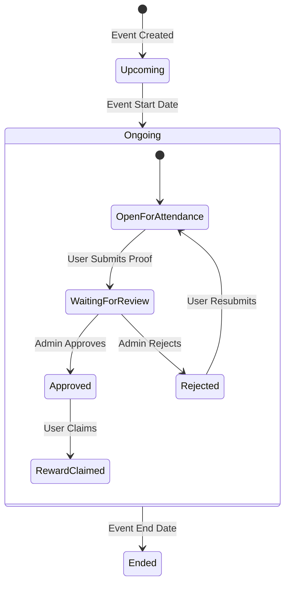
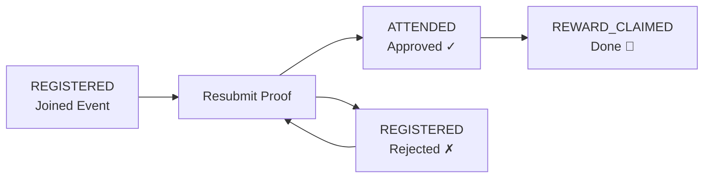

# EcoBud Eco Events - Simple Flow

## User Flow (Mobile App)

```mermaid
flowchart TD
    A["User Opens App"] --> B{"Browses Events"}
    B --> C["Sees Event on Home Screen\nor Events Page"]
    C --> D["Taps 'Join Event'"]
    D --> E["Slot Reserved ✓"]

    E --> F{"Event Day Arrives"}
    F --> G["User Goes to Event Location"]
    G --> H["Takes a Photo as Proof"]
    H --> I["Scans QR Code at Venue"]
    I --> J["Photo + QR Sent for Review"]

    J --> K{"Admin/Moderator\nReviews Submission"}
    K -->|"Approved ✓"| L["User Sees 'Claim Reward'"]
    K -->|"Rejected ✗"| M["User Can Resubmit\nif Event Still Ongoing"]
    M --> H

    L --> N["User Taps 'Claim Reward'"]
    N --> O["Earns Eco-Points\n& Eco-Coins 🎉"]
```

## Admin Flow (Web Panel)

```mermaid
flowchart TD
    A["Admin Opens\nWeb Panel"] --> B["Events Dashboard"]

    B --> C{"What Does\nAdmin Want?"}
    C -->|"Create Event"| D["Fills Event Details\nTitle, Date, Location,\nCapacity, Rewards"]
    D --> E["Uploads Event Image"]
    E --> F["Event is Live ✓"]

    C -->|"Manage Event"| G["Edits or Deletes\nExisting Event"]
    G --> H["Event Updated ✓"]

    C -->|"Generate QR Code"| I["Creates QR Code\nfor Event Venue"]
    I --> J["QR Ready to Display ✓"]

    C -->|"Review Submissions"| K{"Approve or\nReject?"}
    K -->|"Approve ✓"| L["User Gets Notified\n& Can Claim Reward"]
    K -->|"Reject ✗"| M["User Notified\nwith Reason"]
```

## Event Status Lifecycle

```mermaid
stateDiagram-v2
    [*] --> Upcoming : Event Created
    Upcoming --> Ongoing : Event Start Date
    Ongoing --> Ended : Event End Date

    state Ongoing {
        [*] --> OpenForAttendance
        OpenForAttendance --> WaitingForReview : User Submits Proof
        WaitingForReview --> Approved : Admin Approves
        WaitingForReview --> Rejected : Admin Rejects
        Rejected --> OpenForAttendance : User Resubmits
        Approved --> RewardClaimed : User Claims
    }
```

## How Registration Status Changes

```mermaid
flowchart LR
    A["REGISTERED\nJoined Event"] --> B["PENDING_APPROVAL\nProof Submitted"]
    B --> C["ATTENDED\nApproved ✓"]
    B --> D["REGISTERED\nRejected ✗"]
    C --> E["REWARD_CLAIMED\nDone 🎉"]
    D --> B["Resubmit Proof"]
```
